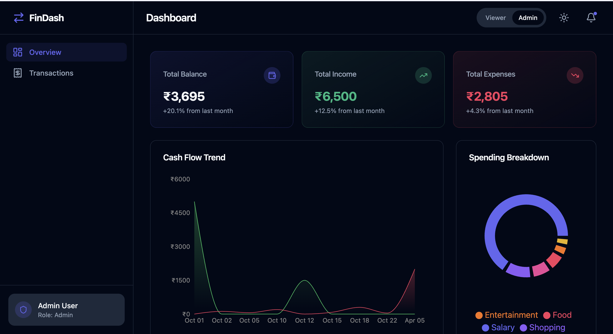
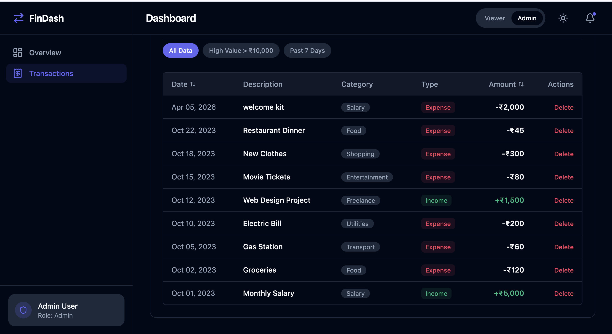

# Finance Dashboard 💸

A premium, highly-interactive Personal Finance Dashboard built natively in React. This application provides a seamless way to track, manage, and visualize your financial flows with enterprise-grade UI scaling from desktop to mobile screens.


*Beautiful deep-data visualizations highlighting spending, balance trajectories, and intelligent financial insights.*

## 🎯 Overview of Approach

The philosophy behind this dashboard is to merge robust data manipulation with premium, modern "FinTech" aesthetics. The application utilizes a **Mobile-First Responsive Design** powered by Tailwind CSS to ensure the UI behaves fluidly across any device format (including a bespoke mobile bottom-navigation drawer). 

To cleanly manage state without backend complexity, the dashboard relies on a custom `DashboardContext` wrapper. This Context engine completely isolates the logic for simulating network requests, persisting data to `localStorage`, and broadcasting UI themes/roles, allowing the visual components to cleanly map and filter the data.

---

## 🚀 Core Features & Requirements Fulfilled

### **1. Dashboard Overview**
- **Summary Cards:** Real-time calculated cards for *Total Balance*, *Income*, and *Expenses*.
- **Time-based Visualization:** A responsive area chart (`Recharts`) plotting balance trends seamlessly across active transaction dates.
- **Categorical Visualization:** A dynamic Pie Chart providing a strict breakdown of categorized expenses.

### **2. Frictionless Transaction Management**
- **Dynamic Ledger:** A structured table tracking all income and expenses containing the `Date`, `Amount`, `Category`, and `Type`.
- **Sorting & Search:** Includes multi-dimensional sorting logic and a dual-purpose search bar (filters by both `Category` and `Description`).
- **Empty States:** The table gracefully renders empty states if filters yield no results.

### **3. Role-Based Data Flow (RBAC)**
- Toggle seamlessly between a **Viewer** identity (pure read-only consumption with hidden controls) and an **Admin** identity unlocking full data manipulation via the Header nav.
- As an Admin, seamlessly `Add` or `Delete` transactions through an animated modal wizard. State and UI buttons intelligently adapt based on the active role.

### **4. Intelligent Insights**
- Ships with an algorithmic Insights generator card beside the charts, dynamically altering the user to their top *Highest Spending Category* based on the active data constraints.

### **5. State Management Approach**
- Centralized via React `Context API` (`DashboardContext.jsx`). Data (transactions, active role, current theme preference) is handled securely in global state.

---

## ⭐ Optional Enhancements Included (100% Fulfilled)

This project went above and beyond to implement every optional metric outlined:

- ✅ **Dark Mode:** Deep native integration mapping to system preferences or manual toggling via the sun/moon icon.
- ✅ **Data Persistence:** Implemented seamless browser `localStorage` binding. Refreshing preserves all added mock data, roles, and themes.
- ✅ **Mock API Integration:** The data loader utilizes asynchronous `Promise` latency (`setTimeout`) perfectly emulating database fetch times, surfacing polished loading spinners before the dashboard mounts.
- ✅ **Animations & Transitions:** Micro-interactions (hovers, slide-ups) using `tailwindcss-animate`, plus custom math-driven animated rolling-number counters on the main balance metrics.
- ✅ **Export functionality (CSV):** Native JS byte-blob packing allows you to export your filtered transactions directly as a `finance_transactions.csv`.
- ✅ **Advanced Filtering:** One-click quick Macro Pills (e.g., `Past 7 Days`, `High Value > ₹10k`) allowing power users to instantly parse the dataset.


*The Transactions page featuring Quick Filter Macros, CSV Exports, and role-based access table modifiers.*

---

## 🛠️ Setup Instructions

To get this dashboard running beautifully on your local machine instantly:

**1. Clone the project locally**
```bash
git clone <repository-url>
cd sanjay-project
```

**2. Ensure you have Node (v18+) installed, then fetch dependencies**
```bash
npm install
```

**3. Boot the Vite Dev Server**
```bash
npm run dev
```

**4. Explore**
Navigate to `http://localhost:5173`. 
*(Note: Be sure to use the Moon/Sun toggle in the header, or toggle the Admin role to see the application expand its controls!)*

---

## 🌐 Deployment
This project features an automated CI/CD pipeline built on GitHub Actions. It is statically hosted and perfectly served over GitHub Pages via the `.github/workflows/deploy.yml` pipeline upon committing to `main`.
